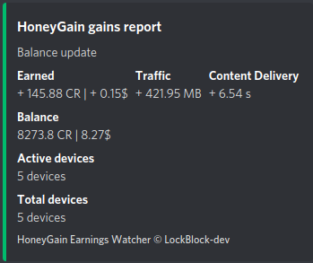
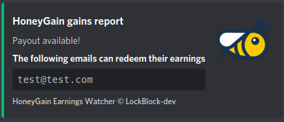

# honeygain earnings watcher

[](https://www.npmjs.com/package/axios) [](https://www.npmjs.com/package/honeygain.js) [](https://www.npmjs.com/package/simple-discord-webhooks)

[](https://github.com/LockBlock-dev/honeygain-earnings-watcher/stargazers)

Send a report of your hourly earnings to a channel via a Discord webhook.

Bugs can occur, this is an unofficial use of the HoneyGain API.

## Installation

-   Install [NodeJS](https://nodejs.org).
-   Download or clone the project.
-   Run `install.bat` OR run `npm install`.
-   In the [config.js](./index.js), you need to edit the WEBHOOK URL and the AUTH TOKENs:

```js
module.exports = {
    discordWebhookURL: "WEBHOOK URL", //Discord WebHook URL

    authTokens: ["AUTH TOKEN 1", "AUTH TOKEN 2"], //see https://github.com/LockBlock-dev/honeygain.js/blob/master/Authorization.md

    modes: ["total", "payout"], //you can put one mode or all of them

    delay: 40, //delay before updating earnings

    jmpt: false, //if you are using JumpTask
};
```

-   Run `start.bat` OR `node index.js` OR `npm start`.

## How do I find my Authorization token ?!

Please check this [link](https://github.com/LockBlock-dev/honeygain.js/blob/master/Authorization.md).

## What is what

-   **discordWebhookURL**: the Discord Webhook URL you created
-   **authTokens**: the tokens used to log into honeygain
-   **modes**:
    -   total:  
        
    -   payout:  
        
-   **delay**: the delay before updating the earnings

## How does it work

The script checks every minute if it is an exact hour (17:00, 8:00, ...). Then it waits 40 seconds to allow all earnings to update. After that it gets your earnings with the provided token. Finally, it calculates the difference between your previous balance and the new one, checks if any of the account can request their earnings and sends the results to the Discord WebHook.

This means the webhook message will be sent at XX:00:40. Don't panic if you don't see any messages in the first few seconds.

## Credits

[HoneyGain](https://honeygain.com)

## Copyright

See the [license](/LICENSE)
